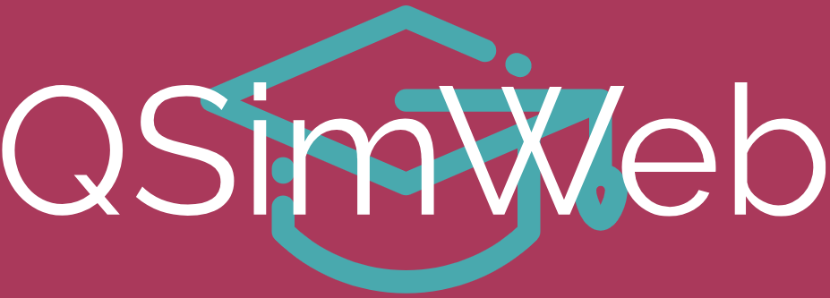

# QSim-Web-v2

<picture>
  <source srcset="src/images/qsimweb_t.png" media="(prefers-color-scheme: dark)">
  
</picture>

Una mejora del simulador para el lenguaje simil a Assembly de bajo nivel **Q**, utilizado en la Universidad Nacional de Quilmes con propósitos educativos.

El proyecto original fue desarrollado por Pablo Pissi y Francisco Perez Ramos a principios de 2021

## Despligue con los cambios
🔗 [En este enlace](https://qsimweb-v2.vercel.app)

## ¿Que estamos mejorando?
🐞 Errores que contradicen la teoria vista durante la cursada de Orga

🗣️ El feedback recibido ante errores en el código

📂 El funcionamiento de las pestañas del simulador

🖥️ Representación de la Arquitectura de Q

## ¿Y que novedades?

🔍 Sugerencias de instrucciones al escribir programas

## 📖 Documentación
[Presentación: Prueba de concepto](/docs/2024s2/QSimWebv2%20-%20POC.pptx.pdf)

[Presentación: Demo final](/docs/2024s2/QSimWebv2%20-%20PFinal.pptx.pdf)

[Archivo de refactor](/docs/2024s2/Refactor%20-%20QsimWebv2.docx)

## Video de la Demo
[Demo del simulador](https://drive.google.com/file/d/12MfAEbUoAR1lv9kS361h4WYJTvUvaDRp/view?usp=sharing)

## 👤 Integrantes

Agustin Lascar, Franco Garcino Ruiz
